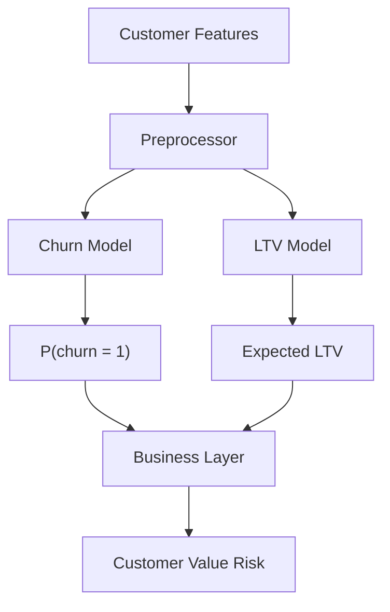

Data Folder -> This is where we put downloaded dataset
api foler ->  This is for Flask web api
src -> Scripts for Data preprocessing and ML Models 

Step1 - Data cleaning and preprocessing part 

-> We use openpyxl library to open .xlsx files in Python without needing MS Office. 
-> If we want to drop rows in df but only when specific column has null value in that row, say when Customer ID is null only then row must be dropped. We use 'subset' parameter inside .dropna() function which is a list of columns. 

CREATING FEATURE MATRIX AND TARGET MATRIX (Dataset has data from 2 years 2009-2010 and 2010-2011)

-> We use Year 1 data to make our feature matrix, for target labels we will use Year 2 data. 
-> We will then combine all that to make a new dataset. 
-> We need to groupby customer id and feautres which we choose.

-> We build Feature matrix X using RFM (Recency, Frequency and Monetary) idea. Each Customer id will have it.

-> We are using Year 1 data to build feature matrix because it helps with understanding Cutomer behaviural patterns. 
-> We split our clean_df into to different df's according to timeline

EDA PART

-> Applying log(1+x) transformation to Monetary, AvgBasketSize, Frequency and Recnecy columns to pull those heavy skewness 

MODELLING PART

-> We input Raw Feature matrix X (after log transformation and other important things) and now modelling will happen in 2 stages 

-> Stage-1 Will be about Classification (Churn Classification) It will predict P(Churn) which belongs to [0,1] 

-> Stage-2 Will be about Regression to estimate LTV which customer will spend in future, given that he spends in Year-2 (LTV Year-2 > 0) 

-> We get Expected LTV = (1-P(Churn)) x Predicted LTV 

-> For Target Variable Target_LTV we will again use log transformation

| Column Name | Meaning | Tranformation Applied | Reason for Transformation |
| ----------- | ------- | --------------------- | ------------------------- |
|`Customer ID`| ID Column only for unique identification | Nothing Applied | - |
|`Recency`| Last visit of customer | Nothing Applied | - |
|`Tenure` | How long customer has been connected with business | Nothing Applied | - |
|`Frequency`| How frequently customer visits | log transformation | To tackle the severe right tail issue
|`Monetary`| Total Spending made by customer | log transformation | To tackle the severe right tail issue |
|`AvgBasketSize`| The avg quantity bought by customer per order | log transformation | To tackle the severe right tail issue |

The output is a vector yi = [LTVi, Churni] where 
LTVi predicts -> How much future Revenue is this customer likely to generate.
Churni predicts -> Is this customer likely to become inactive.

The real question which model is trying to solve is -> If this customer is at the risk of churning, how much future value is potentially lost if he churns.

This helps us to draw the following flowchart 

This leads us to make 2 different kinds of models. 

Binary Classification which will calculate Churn

P(Ychurn = 1 | X)

Continous Regression Model which will predict LTV value of customer 

E[YLtv | X]
Expected Customer Value at Risk = P(Ci = 1 | Xi) * predicted_LTVi

